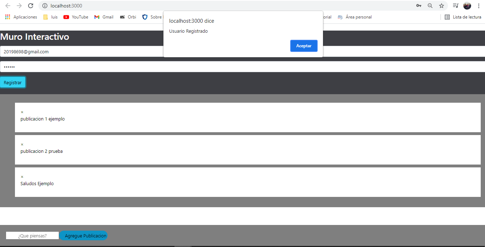
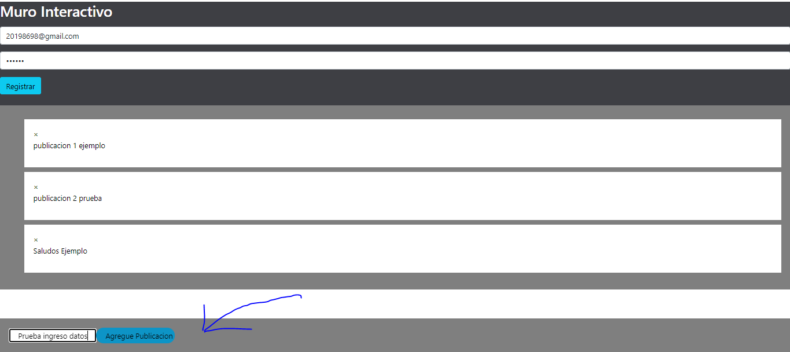
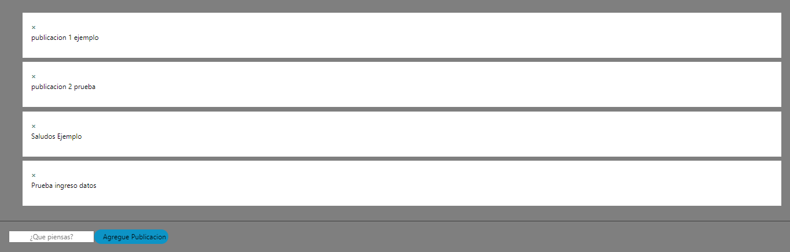

Proyecto Web - Muro Interactivo- Luis Eduardo Taveras 2019-8698.
React y Firebase.

Dentro del sistema web encontramos distintos componentes que complementan las funcionalidades del proyecto final.
En el cual desarrolle el backend con javascript (ES6), React y firebase como determinaba el mandato del proyecto.

De este logre crear cuentas de usuarios, de las cuales estas se almacenan en el firebase pero tuve algunos inconvenientes para terminar el proyecto.

De las funcionalidades tenemos la creacion de los usuarios. "estos almacenados en el firebase y la creacion de las publicaciones pero estas se almacenan localmente, no logre establecer la conexion con el firebase.

Adjuntando las imagenes veremos lo anterior comentado.
    
    

